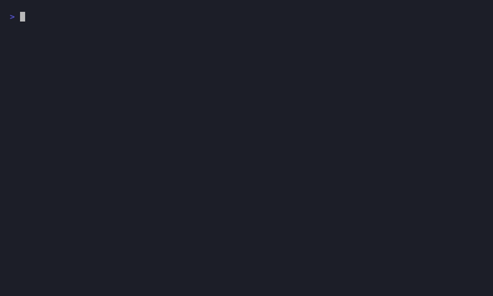

# cli

[](https://github.com/toaweme/cli/actions/workflows/tests.yml)
[](https://pkg.go.dev/github.com/toaweme/cli)
[](https://github.com/toaweme/cli/releases)
[](/LICENSE)

## Effortless Go CLI apps



`github.com/toaweme/cli` is a small, generics-based lib for building command-line apps where a command is just a struct. 
Its flags, positional arguments, environment bindings, defaults, and validation rules are declared once as struct tags, and the module does the parsing, merging, validating, help, and dispatch.

## Module

- `cli.NewApp(Config, GlobalFlags)` builds an [App]; chain the setters to wire it up.
  - `App.Add(name, cmd)` registers a command and returns it, so subcommands chain off the result.
  - `App.Default(cmd)` sets the command that runs on a bare invocation (no args).
  - `App.Resolve(...Resolver)` registers an ordered config resolver chain (lowest precedence first).
  - `App.Help(cmd)` registers the help renderer; `App.HelpOutputs(...)` adds output codecs.
  - `App.Run(osArgs)` parses, merges, validates, and dispatches.
- `cli.BaseCommand[T]` is embedded in your command struct; `T` is the config struct whose tags define the flags and args. `cli.NewBaseCommand[T]()` constructs it; the parsed config lands in `c.Inputs`.
- `cli.Command[T]` is the interface every command satisfies (mostly free via `BaseCommand`): `Run`, plus help providers (`Help`, `Description`, `Examples`, `Args`, `Flags`).
- `cli.IsRealError(err)` filters the `ErrShowingHelp` / `ErrShowingVersion` clean-exit sentinels from genuine failures.
- `cli.Verbosity` is an optional embeddable `-v`/`-vv`/`-vvv` flag group with a `Level()` query.

## Overview

### A command is a struct

Define the config (flags and positional args, via tags) and a command that embeds `BaseCommand[ThatConfig]`:

```go
type GreetConfig struct {
	Name  string `arg:"0" env:"GREET_NAME" help:"Name to greet" rules:"required"`
	Shout bool   `arg:"shout" short:"s" help:"Uppercase the greeting"`
}

type GreetCommand struct {
	cli.BaseCommand[GreetConfig]
}

func (c *GreetCommand) Run(_ cli.GlobalFlags, _ cli.Unknowns) error {
	msg := fmt.Sprintf("hello, %s!", c.Inputs.Name)
	if c.Inputs.Shout {
		msg = strings.ToUpper(msg)
	}
	fmt.Println(msg)
	return nil
}

func (c *GreetCommand) Help() string { return "Greet someone by name" }
```

The tags drive everything:

- `arg:"0"` is a positional argument (by zero-based index); `arg:"shout"` is a named flag (`--shout`).
- `short:"s"` adds `-s`.
- `env:"GREET_NAME"` binds an environment variable.
- `default:"..."` seeds a value when nothing else sets it.
- `help:"..."` is the one-line help text.
- `rules:"required"` (and `rules:"oneof:a,b,c"`) validate the merged value.
- `secret:"true"` masks the resolved value in `--help-values` output.
- `sep:","` splits a single string into a scalar slice (`[]string`, `[]int`, ...).

### Merge precedence

Before `Run`, the module merges values for the matched command in this order of increasing precedence:

```
struct default  <  resolver chain (files / mapping)  <  environment  <  parsed flags
```

Flags always win. With no resolvers registered, only defaults, env, and flags apply. Env is folded in by the core, so file config is entirely optional.

### Subcommand trees

`Add` returns the command it registered, so trees chain naturally. A parent that only groups subcommands returns `cli.ErrDisplaySubCommands` from `Run` to print its child list:

```go
db := app.Add("db", &DBCommand{BaseCommand: cli.NewBaseCommand[struct{}]()})
db.Add("migrate", &MigrateCommand{BaseCommand: cli.NewBaseCommand[struct{}]()})
// runs the leaf:  tool db migrate
```

### Embedded vs nested config

Following Go's own field-promotion rules (and `structs`): an anonymous embedded struct has its fields promoted to plain top-level flags (no prefix), while a named (tagged) nested struct groups under a dotted path (`database.host`). Embed a shared `RepoFlags` to give several commands the same flags with zero duplication.

### Built-in globals

`--help`/`-h`, `--version`/`-V`, `--cwd`, and `--help-format` are parsed before dispatch and passed to every `Run` as `cli.GlobalFlags`. The reserved shorts are deliberately minimal (`-h`, `-V`) so they never squat on your own DX: `-v`, `-c`, and `--format` stay yours. `-h` and `-V` trigger regardless of position. Help and version are handled by the module, which then returns the `ErrShowingHelp` / `ErrShowingVersion` sentinels; `IsRealError` filters them at the call site.

## Install

```sh
go get github.com/toaweme/cli
```

## Quickstart

```go
package main

import (
	"fmt"
	"os"
	"strings"

	"github.com/toaweme/cli"
)

type GreetConfig struct {
	Name  string `arg:"0" env:"GREET_NAME" help:"Name to greet" rules:"required"`
	Shout bool   `arg:"shout" short:"s" help:"Uppercase the greeting"`
}

type GreetCommand struct {
	cli.BaseCommand[GreetConfig]
}

func (c *GreetCommand) Run(_ cli.GlobalFlags, _ cli.Unknowns) error {
	msg := fmt.Sprintf("hello, %s!", c.Inputs.Name)
	if c.Inputs.Shout {
		msg = strings.ToUpper(msg)
	}
	fmt.Println(msg)
	return nil
}

func (c *GreetCommand) Help() string { return "Greet someone by name" }

func main() {
	app := cli.NewApp(
		cli.Config{Name: "greet", Version: "1.0.0"},
		cli.GlobalFlags{},
	)
	app.Add("hello", &GreetCommand{BaseCommand: cli.NewBaseCommand[GreetConfig]()})

	if err := app.Run(os.Args[1:]); cli.IsRealError(err) {
		fmt.Fprintf(os.Stderr, "error: %v\n", err)
		os.Exit(1)
	}
}
```

```sh
greet hello Ada            # hello, Ada!
greet hello Ada --shout    # HELLO, ADA!
GREET_NAME=Ada greet hello # hello, Ada!  (env binding)
greet hello --help         # generated help for the command
greet --version            # greet 1.0.0
```

## Features

- **Command-as-struct** - declare flags, positional args, env bindings, defaults, validation, and help once as struct tags; embed `BaseCommand[T]` and implement `Run`. The parsed config is `c.Inputs`.
- **Layered config merge** - `default` < resolver chain < env < flags, in that order, with flags always winning. Env is folded by the core, so file config stays optional.
- **Decoupled resolvers** - the only config seam in core is the `Resolver` interface; resolvers compose like middleware. The core never imports the file-config package.
- **Subcommand trees** - `Add` chaining and parent placeholders; a default command for bare invocation.
- **Type coercion and slice splitting** - loosely typed inputs (an env string `"9090"`) land in the field's real type; a single string splits into a scalar slice via `sep`.
- **Embedded and nested config** - embedded structs promote to top-level flags (no prefix); named nested structs group under a dotted path.
- **Minimal, non-squatting globals** - only `-h` and `-V` are reserved; `--cwd` is long-only and help formatting is `--help-format`, leaving `-v`/`-c`/`--format` for you.
- **Optional verbosity** - embed `cli.Verbosity` for `-v`/`-vv`/`-vvv` with `Level()`/`Verbose()`/`AtLeast()`; the module imposes no verbosity of its own.
- **Clean-exit sentinels** - `ErrShowingHelp` / `ErrShowingVersion` plus the `IsRealError` helper so the call site filters them in one call.
- **Rich, multi-format help** - one-line `Help()` plus `Description`, `Examples`, `Args`, `Flags` providers; output as `plain`, `pretty`, `md`, `json`, or `jsonschema`, with pluggable `OutputCodec`s.
- **Resolved-value help** - `--help-values` annotates each flag with its merged value (defaults < config < env < flags), with secrets prefix-masked so they never leak into pasted help.
- **Shell completion** - `bash`/`zsh`/`fish` scripts and the `__complete` hook via `commands/completion`.
- **Docs generation** - `commands/gendocs` renders the app's own command tree to files in every help format, using the same in-process renderers as `--help-format`, so docs never go stale.
- **`.env` loading** - `LoadDotEnv()` sets unset env vars; `GetDotEnv()`/`GetDotEnvs()` parse into a map without touching the environment.

## Sub-packages (opt-in)

The core is dependency-light. Pull these in only when you need them:

- `commands/help` - `help.NewHelpCommand(...)` (register with `app.Help(...)`) and `help.NewParentPlaceholder()` for grouping subcommands.
- `commands/completion` - `completion.NewCompletionCommand(appName)` for shell completion scripts.
- `commands/gendocs` - `gendocs.NewGenDocsCommand(...)` to generate reference docs.
- `config` - file-backed configuration:
  - `config.NewFileStore(dir, name, ensureConfigDir, codec...)` - one config file with whole-file (`Read`/`Write`/`Exists`/`Delete`) and dotted-key (`KeyRead`/`KeyWrite`/...) access. Reads create nothing and report absence explicitly (`ErrConfigNotFound` / `ErrKeyNotFound`).
  - `config.FileSecrets(dir, codec...)` - the same store at 0600, named `secrets`.
  - `config.NewResolver(store, rules)` - one resolver per store, satisfying `cli.Resolver` structurally; layer several via `app.Resolve(global, project, secrets)`. Optional per-command field mapping rules.
  - `config.Discover(...)` / `config.HomePath(appName)` helpers; `~` home expansion.
  - Codecs are addons: `config/addons/json`, `config/addons/yaml`, `config/addons/toml` (each `New(exts...)`); JSON is the default and YAML/TOML are separate modules carrying their own third-party deps. The CLI works with none registered.

A fully wired app using all of the above:

```go
app := cli.NewApp(
	cli.Config{Name: "full", Version: "0.1.0"},
	cli.GlobalFlags{},
).Resolve(
	config.NewResolver(config.NewFileStore(config.HomePath("full"), "config", true), nil),
	config.NewResolver(config.NewFileStore(cwd, "config", true), nil),
	config.NewResolver(config.FileSecrets(config.HomePath("full")), nil),
)

app.Help(help.NewHelpCommand(app.Config, app.Commands, app.OutputFormats))
app.Add("completion", completion.NewCompletionCommand("full"))
app.Add("gendocs", gendocs.NewGenDocsCommand(app.Config, app.Commands, app.OutputFormats))
```

## Runnable examples

See [`example_test.go`](./example_test.go) for short, runnable versions of everything above, and [`examples/`](./examples) for complete programs (`basic`, `greet`, `server`, `deploy`, `full`, `full_3rd_party`).

```sh
go test -run Example -v
```
